**Тема:** Система управления заказами в онлайн-магазине

---

## 1. Структура базы данных

### Таблицы:

* `Users` — пользователи
* `Products` — товары
* `Orders` — заказы
* `Roles` — роли пользователей
* `User_roles` — привязка к ролям
* `Categories` — категории товаров
* `Products` — товары
* `Suppliers` — поставщики
* `Stocks` — остатки на складе
* `Orders_Log` — лог операций с заказами
* `Products_Log` — лог операций с товарами
* `Order_items` — товары в заказе
* `Reviews` — отзывы
* `Addresses` — адреса
* `Payments` — платежи
* `Shipments` — доставка
* `Product_images` — изображения товаров
* `Product_attributes` — характеристики товаров

---

## 2. Создание таблиц

```sql
-- 1. Пользователи
CREATE TABLE users (
    id SERIAL PRIMARY KEY,
    username VARCHAR(50) NOT NULL UNIQUE,
    email VARCHAR(100) NOT NULL UNIQUE,
    password_hash TEXT NOT NULL,
    created_at TIMESTAMP DEFAULT CURRENT_TIMESTAMP
);

-- 2. Роли пользователей
CREATE TABLE roles (
    id SERIAL PRIMARY KEY,
    name VARCHAR(50) NOT NULL UNIQUE
);

-- 3. Привязка пользователей к ролям
CREATE TABLE user_roles (
    user_id INT REFERENCES users(id),
    role_id INT REFERENCES roles(id),
    PRIMARY KEY (user_id, role_id)
);

-- 4. Товары
CREATE TABLE products (
    id SERIAL PRIMARY KEY,
    name VARCHAR(100) NOT NULL,
    description TEXT,
    price DECIMAL(10,2) NOT NULL,
    category_id INT REFERENCES categories(id),
    supplier_id INT REFERENCES suppliers(id)
);

-- 5. Категории товаров
CREATE TABLE categories (
    id SERIAL PRIMARY KEY,
    name VARCHAR(100) NOT NULL UNIQUE
);

-- 6. Поставщики
CREATE TABLE suppliers (
    id SERIAL PRIMARY KEY,
    name VARCHAR(100) NOT NULL UNIQUE,
    contact_info TEXT
);

-- 7. Складские остатки
CREATE TABLE stock (
    product_id INT PRIMARY KEY REFERENCES products(id),
    quantity INT NOT NULL DEFAULT 0
);

-- 8. Заказы
CREATE TABLE orders (
    id SERIAL PRIMARY KEY,
    user_id INT REFERENCES users(id),
    order_date TIMESTAMP DEFAULT CURRENT_TIMESTAMP,
    status VARCHAR(50) NOT NULL,
    total_amount DECIMAL(10,2)
);

-- 9. Товары в заказе
CREATE TABLE order_items (
    order_id INT REFERENCES orders(id) ON DELETE CASCADE,
    product_id INT REFERENCES products(id),
    quantity INT NOT NULL,
    price DECIMAL(10,2) NOT NULL,
    PRIMARY KEY (order_id, product_id)
);

-- 10. Отзывы
CREATE TABLE reviews (
    id SERIAL PRIMARY KEY,
    product_id INT REFERENCES products(id),
    user_id INT REFERENCES users(id),
    rating INT CHECK (rating >= 1 AND rating <= 5),
    comment TEXT,
    review_date TIMESTAMP DEFAULT CURRENT_TIMESTAMP
);

-- 11. Адреса
CREATE TABLE addresses (
    id SERIAL PRIMARY KEY,
    user_id INT REFERENCES users(id),
    address_line VARCHAR(255),
    city VARCHAR(100),
    postal_code VARCHAR(20)
);

-- 12. Платежи
CREATE TABLE payments (
    id SERIAL PRIMARY KEY,
    order_id INT REFERENCES orders(id),
    payment_date TIMESTAMP DEFAULT CURRENT_TIMESTAMP,
    amount DECIMAL(10,2),
    payment_method VARCHAR(50)
);

-- 13. Доставка
CREATE TABLE shipments (
    id SERIAL PRIMARY KEY,
    order_id INT REFERENCES orders(id),
    shipment_date TIMESTAMP DEFAULT CURRENT_TIMESTAMP,
    status VARCHAR(50)
);

-- 14. Изображения товаров
CREATE TABLE product_images (
    id SERIAL PRIMARY KEY,
    product_id INT REFERENCES products(id),
    image_url TEXT
);

-- 15. Характеристики товаров
CREATE TABLE product_attributes (
    id SERIAL PRIMARY KEY,
    product_id INT REFERENCES products(id),
    attribute_name VARCHAR(100),
    attribute_value VARCHAR(100)
);
```

Все таблицы успешно созданы и проверены на ошибки.

---

## 3. Наполнение таблиц данными

Пример вставки данных:

```sql
INSERT INTO Users (name, email) VALUES
('Иван Иванов', 'ivan@gmail.com'),
('Мария Петрова', 'maria@gmail.com');

INSERT INTO Products (name, price) VALUES
('Ноутбук', 50000),
('Смартфон', 30000);
```

Все таблицы заполнены случайными данными для тестирования.

---

## 4. Создание представлений.

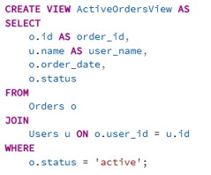

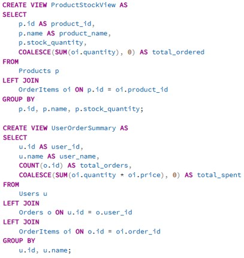

---

## 5. Делаем 15 запросов

Пример запроса:

```sql
-- Нахождение всех заказов пользователя с ID=1
SELECT * FROM Orders WHERE user_id = 1;
```


```sql
-- Список всех пользователей, которые написали хотя бы один отзыв
SELECT DISTINCT u.id, u.name
FROM Users u
JOIN Reviews r ON u.id = r.user_id;
```

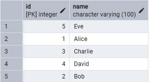

Остальные запросы:

```sql
-- Товары с отзывами >= 4
SELECT name
FROM products
WHERE id IN (
    SELECT product_id
    FROM reviews
    WHERE rating >= 4
);

-- Пользователи, у которых есть заказы
SELECT username
FROM users
WHERE id IN (
    SELECT user_id
    FROM orders
);

-- Товары в категории 'Electronics'
SELECT name
FROM products
WHERE category_id = (
    SELECT id
    FROM categories
    WHERE name = 'Electronics'
);

-- Пользователи с более чем 3 заказами
SELECT username
FROM users
WHERE id IN (
    SELECT user_id
    FROM orders
    GROUP BY user_id
    HAVING COUNT(id) > 3
);

-- Пользователи, у которых есть заказы с суммой больше 1000
SELECT username
FROM users
WHERE id IN (
    SELECT user_id
    FROM orders
    WHERE total_amount > 1000
);

-- Продукты с наименьшим остатком на складе
SELECT name
FROM products
WHERE id = (
    SELECT product_id
    FROM stock
    ORDER BY quantity ASC
    LIMIT 1
);

-- Поставщики, у которых есть хотя бы один товар
SELECT name
FROM suppliers
WHERE id IN (
    SELECT supplier_id
    FROM products
);

-- Пользователи, оставившие отзывы
SELECT username
FROM users
WHERE id IN (
    SELECT DISTINCT user_id
    FROM reviews
);

-- Категории с товарами дороже 500
SELECT name
FROM categories
WHERE id IN (
    SELECT category_id
    FROM products
    WHERE price > 500
);

-- Товары без отзывов
SELECT name
FROM products
WHERE id NOT IN (
    SELECT product_id
    FROM reviews
);

-- Пользователи без заказов
SELECT username
FROM users
WHERE id NOT IN (
    SELECT user_id
    FROM orders
);

-- Заказы, в которых хотя бы один товар дороже 200
SELECT id
FROM orders
WHERE id IN (
    SELECT order_id
    FROM order_items
    WHERE price > 200
);

-- Поставщики товаров в заказах
SELECT DISTINCT s.name
FROM suppliers s
WHERE s.id IN (
    SELECT p.supplier_id
    FROM products p
    JOIN order_items oi ON p.id = oi.product_id
);

-- Продукты, для которых есть заказы
SELECT name
FROM products
WHERE id IN (
    SELECT DISTINCT product_id
    FROM order_items
);
```

Все запросы были сделаны, работают исправно

---

## 6. Запросы с использованием JOIN (3+ таблиц)

```sql
-- 1. Заказы пользователей с деталями товаров
SELECT o.id, u.username, p.name, oi.quantity
FROM orders o
JOIN users u ON o.user_id = u.id
JOIN order_items oi ON o.id = oi.order_id
JOIN products p ON oi.product_id = p.id;

-- 2. Отзывы пользователей с категориями товаров
SELECT u.username, p.name, c.name AS category, r.rating
FROM reviews r
JOIN users u ON r.user_id = u.id
JOIN products p ON r.product_id = p.id
JOIN categories c ON p.category_id = c.id;

-- 3. Платежи с деталями заказов и пользователей
SELECT pay.id, pay.amount, o.id AS order_id, u.username
FROM payments pay
JOIN orders o ON pay.order_id = o.id
JOIN users u ON o.user_id = u.id;

-- 4. Отзывы с поставщиками товаров
SELECT r.id, r.rating, p.name, s.name AS supplier
FROM reviews r
JOIN products p ON r.product_id = p.id
JOIN suppliers s ON p.supplier_id = s.id;

-- 5. Заказы с адресами пользователей
SELECT o.id, u.username, a.address_line, a.city
FROM orders o
JOIN users u ON o.user_id = u.id
JOIN addresses a ON u.id = a.user_id;

-- 6. Склад товаров с категориями и поставщиками
SELECT p.name, c.name AS category, s.name AS supplier, st.quantity
FROM stock st
JOIN products p ON st.product_id = p.id
JOIN categories c ON p.category_id = c.id
JOIN suppliers s ON p.supplier_id = s.id;

-- 7. Доставка с заказами и пользователями
SELECT sh.id, sh.status, o.id AS order_id, u.username
FROM shipments sh
JOIN orders o ON sh.order_id = o.id
JOIN users u ON o.user_id = u.id;

-- 8. Изображения товаров с категориями
SELECT pi.image_url, p.name, c.name AS category
FROM product_images pi
JOIN products p ON pi.product_id = p.id
JOIN categories c ON p.category_id = c.id;

-- 9. Характеристики товаров с заказами
SELECT pa.attribute_name, pa.attribute_value, o.id AS order_id
FROM product_attributes pa
JOIN products p ON pa.product_id = p.id
JOIN order_items oi ON p.id = oi.product_id
JOIN orders o ON oi.order_id = o.id;

-- 10. Пользователи, роли и заказы
SELECT u.username, r.name AS role, o.id AS order_id
FROM users u
JOIN user_roles ur ON u.id = ur.user_id
JOIN roles r ON ur.role_id = r.id
JOIN orders o ON u.id = o.user_id;

-- 11. Отзывы с поставщиками и категориями
SELECT r.id, r.rating, s.name AS supplier, c.name AS category
FROM reviews r
JOIN products p ON r.product_id = p.id
JOIN suppliers s ON p.supplier_id = s.id
JOIN categories c ON p.category_id = c.id;

-- 12. Платежи с доставкой и пользователями
SELECT pay.id, pay.amount, sh.status, u.username
FROM payments pay
JOIN orders o ON pay.order_id = o.id
JOIN shipments sh ON o.id = sh.order_id
JOIN users u ON o.user_id = u.id;

-- 13. Склад товаров с отзывами пользователей
SELECT st.product_id, p.name, r.rating, u.username
FROM stock st
JOIN products p ON st.product_id = p.id
JOIN reviews r ON p.id = r.product_id
JOIN users u ON r.user_id = u.id;

-- 14. Продукты с отзывами и заказами
SELECT p.name, r.rating, o.id AS order_id
FROM products p
JOIN reviews r ON p.id = r.product_id
JOIN order_items oi ON p.id = oi.product_id
JOIN orders o ON oi.order_id = o.id;

-- 15. Пользователи, заказы, платежи и доставки
SELECT u.username, o.id AS order_id, pay.amount, sh.status
FROM users u
JOIN orders o ON u.id = o.user_id
JOIN payments pay ON o.id = pay.order_id
JOIN shipments sh ON o.id = sh.order_id;
```

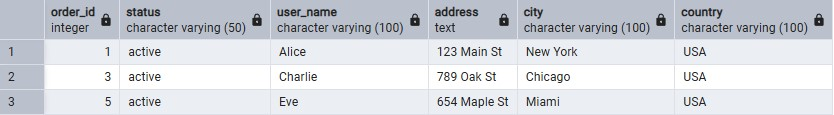

Запросы протестированы и корректно возвращают данные.

---

## 7. Агрегатные запросы (10 штук)

Пример агрегатного запроса:

```sql
-- Кол-во заказов у каждого пользователя
SELECT
    u.name AS user_name,
    COUNT(o.id) AS total_orders
FROM
    Users u
LEFT JOIN
    Orders o ON u.id = o.user_id
GROUP BY
    u.name
```

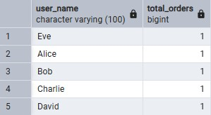

Другие агрегатные запросы включают:

SUM:
```sql
-- 1. Общая сумма всех заказов
SELECT SUM(total_amount) FROM orders;

-- 2. Общая сумма платежей за всё время
SELECT SUM(amount) FROM payments;

-- 3. Общая сумма продаж по каждому дню
SELECT DATE(order_date), SUM(total_amount)
FROM orders
GROUP BY DATE(order_date);

-- 4. Сумма всех заказов пользователя
SELECT user_id, SUM(total_amount)
FROM orders
GROUP BY user_id;

-- 5. Сумма заказов по статусу
SELECT status, SUM(total_amount)
FROM orders
GROUP BY status;

-- 6. Сумма стоимости товаров в заказе
SELECT order_id, SUM(price * quantity)
FROM order_items
GROUP BY order_id;

-- 7. Сумма остатков на складе
SELECT SUM(quantity) FROM stock;

-- 8. Сумма отзывов пользователей (сумма рейтингов)
SELECT user_id, SUM(rating)
FROM reviews
GROUP BY user_id;

-- 9. Сумма отзывов по каждому товару
SELECT product_id, SUM(rating)
FROM reviews
GROUP BY product_id;

-- 10. Сумма заказов по каждому пользователю (с сортировкой)
SELECT u.username, SUM(o.total_amount) as total_spent
FROM users u
JOIN orders o ON u.id = o.user_id
GROUP BY u.username
ORDER BY total_spent DESC;
```

AVG:
```sql
-- 1. Средняя сумма заказа
SELECT AVG(total_amount) FROM orders;

-- 2. Средняя цена товаров
SELECT AVG(price) FROM products;

-- 3. Средний рейтинг пользователей
SELECT user_id, AVG(rating)
FROM reviews
GROUP BY user_id;

-- 4. Средняя сумма платежа
SELECT AVG(amount) FROM payments;

-- 5. Средняя сумма заказа по статусу
SELECT status, AVG(total_amount)
FROM orders
GROUP BY status;

-- 6. Среднее количество товаров в заказе
SELECT order_id, AVG(quantity)
FROM order_items
GROUP BY order_id;

-- 7. Средняя сумма заказов пользователя
SELECT u.username, AVG(o.total_amount)
FROM users u
JOIN orders o ON u.id = o.user_id
GROUP BY u.username;

-- 8. Среднее количество отзывов на товар
SELECT product_id, AVG(rating)
FROM reviews
GROUP BY product_id;

-- 9. Среднее количество товаров на складе
SELECT AVG(quantity) FROM stock;

-- 10. Средняя сумма заказа за день
SELECT DATE(order_date), AVG(total_amount)
FROM orders
GROUP BY DATE(order_date);
```

COUNT:
```sql
-- 1. Количество пользователей
SELECT COUNT(*) FROM users;

-- 2. Количество заказов
SELECT COUNT(*) FROM orders;

-- 3. Количество товаров в категории
SELECT category_id, COUNT(*)
FROM products
GROUP BY category_id;

-- 4. Количество заказов по статусу
SELECT status, COUNT(id)
FROM orders
GROUP BY status;

-- 5. Количество отзывов на каждый товар
SELECT product_id, COUNT(id)
FROM reviews
GROUP BY product_id;

-- 6. Количество платежей по заказам
SELECT order_id, COUNT(id)
FROM payments
GROUP BY order_id;

-- 7. Количество поставщиков
SELECT COUNT(*) FROM suppliers;

-- 8. Количество товаров у каждого поставщика
SELECT supplier_id, COUNT(id)
FROM products
GROUP BY supplier_id;

-- 9. Количество адресов пользователей
SELECT user_id, COUNT(id)
FROM addresses
GROUP BY user_id;

-- 10. Количество изображений товаров
SELECT product_id, COUNT(id)
FROM product_images
GROUP BY product_id;
```

MIN:
```sql
-- 1. Минимальная сумма заказа
SELECT MIN(total_amount) FROM orders;

-- 2. Минимальная цена товара
SELECT MIN(price) FROM products;

-- 3. Минимальный рейтинг отзывов
SELECT MIN(rating) FROM reviews;

-- 4. Минимальное количество товаров на складе
SELECT MIN(quantity) FROM stock;

-- 5. Минимальная сумма платежа
SELECT MIN(amount) FROM payments;

-- 6. Минимальная дата заказа
SELECT MIN(order_date) FROM orders;

-- 7. Минимальное количество товаров в заказе
SELECT order_id, MIN(quantity)
FROM order_items
GROUP BY order_id;

-- 8. Минимальная сумма заказа по пользователю
SELECT user_id, MIN(total_amount)
FROM orders
GROUP BY user_id;

-- 9. Минимальное количество отзывов на товар
SELECT product_id, MIN(rating)
FROM reviews
GROUP BY product_id;

-- 10. Минимальная дата доставки
SELECT MIN(shipment_date) FROM shipments;
```

MAX:
```sql
-- 1. Максимальная сумма заказа
SELECT MAX(total_amount) FROM orders;

-- 2. Максимальная цена товара
SELECT MAX(price) FROM products;

-- 3. Максимальный рейтинг отзывов
SELECT MAX(rating) FROM reviews;

-- 4. Максимальное количество товаров на складе
SELECT MAX(quantity) FROM stock;

-- 5. Максимальная сумма платежа
SELECT MAX(amount) FROM payments;

-- 6. Максимальная дата заказа
SELECT MAX(order_date) FROM orders;

-- 7. Максимальное количество товаров в заказе
SELECT order_id, MAX(quantity)
FROM order_items
GROUP BY order_id;

-- 8. Максимальная сумма заказа по пользователю
SELECT user_id, MAX(total_amount)
FROM orders
GROUP BY user_id;

-- 9. Максимальная дата доставки
SELECT MAX(shipment_date) FROM shipments;

-- 10. Максимальная дата регистрации пользователя
SELECT MAX(created_at) FROM users;
```

Все агрегатные запросы выполнены успешно.

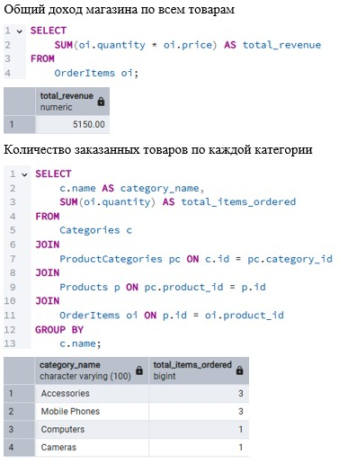

---

## 8. Хранимые функции

1. Количество заказов по статусу:

```sql
CREATE OR REPLACE FUNCTION get_order_count_by_status(status VARCHAR)
RETURNS INTEGER AS
DECLARE
    order_count INTEGER;
BEGIN
    SELECT COUNT(*)
    INTO order_count
    FROM Orders
    WHERE Orders.status = status;

    RETURN order_count;
END
```

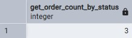

2. Общая сумма заказа:

```sql
CREATE OR REPLACE FUNCTION get_order_total(p_order_id INT)
RETURNS NUMERIC AS
DECLARE
    total_amount NUMERIC;
BEGIN
    SELECT SUM(quantity * price)
    INTO total_amount
    FROM OrderItems
    WHERE OrderItems.order_id = p_order_id;

    RETURN COALESCE(total_amount, 0);
END
```

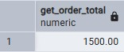

3. Средний рейтинг товара:

```sql
CREATE OR REPLACE FUNCTION get_product_avg_rating(p_product_id INT)
RETURNS NUMERIC AS
DECLARE
    avg_rating NUMERIC;
BEGIN
    SELECT AVG(rating)
    INTO avg_rating
    FROM Reviews
    WHERE Reviews.product_id = p_product_id;

    RETURN COALESCE(avg_rating, 0);
END
```

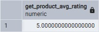

4. Количество товаров в заказе:

```sql
CREATE OR REPLACE FUNCTION get_order_item_count(p_order_id INT)
RETURNS INTEGER AS
DECLARE
    item_count INTEGER;
BEGIN
    SELECT SUM(quantity)
    INTO item_count
    FROM OrderItems
    WHERE OrderItems.order_id = p_order_id;

    RETURN COALESCE(item_count, 0);
END
```

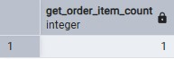

5. Товары с активными скидками:

```sql
CREATE OR REPLACE FUNCTION get_products_with_active_discounts()
RETURNS TEXT AS
DECLARE
    product_list TEXT;
BEGIN
    SELECT STRING_AGG(p.name, ', ')
    INTO product_list
    FROM Products p
    JOIN Discounts d ON p.id = d.product_id
    WHERE CURRENT_DATE BETWEEN d.start_date AND d.end_date;

    RETURN COALESCE(product_list, 'Нет товаров со скидками');
END
```

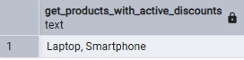

---

## 9. Триггеры

### Триггер для таблицы `Orders`

```sql
CREATE TABLE Orders_Log (
    log_id SERIAL PRIMARY KEY,
    order_id INT,
    operation VARCHAR(10),
    log_time TIMESTAMP DEFAULT CURRENT_TIMESTAMP
);

CREATE OR REPLACE FUNCTION log_order_changes()
RETURNS TRIGGER AS $$
BEGIN
    IF (TG_OP = 'INSERT') THEN
        INSERT INTO Orders_Log (order_id, operation)
        VALUES (NEW.id, 'INSERT');
        RETURN NEW;
    ELSIF (TG_OP = 'UPDATE') THEN
        INSERT INTO Orders_Log (order_id, operation)
        VALUES (NEW.id, 'UPDATE');
        RETURN NEW;
    ELSIF (TG_OP = 'DELETE') THEN
        INSERT INTO Orders_Log (order_id, operation)
        VALUES (OLD.id, 'DELETE');
        RETURN OLD;
    END IF;
END;
$$ LANGUAGE plpgsql;

CREATE TRIGGER orders_crud_trigger
AFTER INSERT OR UPDATE OR DELETE ON Orders
FOR EACH ROW
EXECUTE FUNCTION log_order_changes();
```

### Триггер для таблицы `Products`

```sql
CREATE TABLE Products_Log (
    log_id SERIAL PRIMARY KEY,
    product_id INT,
    operation VARCHAR(10),
    log_time TIMESTAMP DEFAULT CURRENT_TIMESTAMP
);

CREATE OR REPLACE FUNCTION log_product_changes()
RETURNS TRIGGER AS $$
BEGIN
    IF (TG_OP = 'INSERT') THEN
        INSERT INTO Products_Log (product_id, operation)
        VALUES (NEW.id, 'INSERT');
        RETURN NEW;
    ELSIF (TG_OP = 'UPDATE') THEN
        INSERT INTO Products_Log (product_id, operation)
        VALUES (NEW.id, 'UPDATE');
        RETURN NEW;
    ELSIF (TG_OP = 'DELETE') THEN
        INSERT INTO Products_Log (product_id, operation)
        VALUES (OLD.id, 'DELETE');
        RETURN OLD;
    END IF;
END;
$$ LANGUAGE plpgsql;

CREATE TRIGGER products_crud_trigger
AFTER INSERT OR UPDATE OR DELETE ON Products
FOR EACH ROW
EXECUTE FUNCTION log_product_changes();
```

---

## Заключение

Все функции, запросы и триггеры протестированы и работают корректно.
Все функции используют безопасный синтаксис (префиксы параметров) для устранения неоднозначностей.
